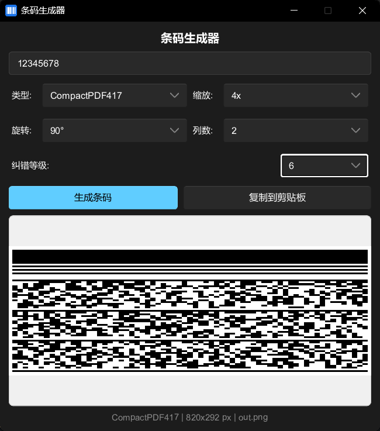

# Rust Learning Project

一个用于学习 Rust 的标准项目结构，方便编写和运行多个示例程序。



## 项目结构

```txt
rust-learning/
├── src/
│   ├── lib.rs          # 库文件，放置可复用的函数
│   └── main.rs         # 主程序入口
├── examples/           # 示例程序目录
│   ├── hello.rs
│   ├── variables.rs
│   └── functions.rs
├── Cargo.toml          # 项目配置文件
└── README.md
```

## 快速开始

### 运行主程序

```bash
cargo run
```

### 运行示例程序

```bash
# 列出所有示例
cargo run --example

# 运行特定示例
cargo run --example hello
cargo run --example variables
cargo run --example functions
```

### 添加新的示例

1. 在 `examples/` 目录下创建新的 `.rs` 文件，例如 `examples/my_example.rs`
2. 编写代码：

    ```rust
    fn main() {
        println!("这是我的示例");
    }
    ```

3. 运行：

    ```bash
    cargo run --example my_example
    ```

### 运行测试

```bash
cargo test
```

### 构建项目

```bash
# 开发模式
cargo build

# 发布模式
cargo build --release
```

## 提示

- 所有 examples 文件都可以使用 `lib.rs` 中定义的公共函数
- 使用 `use rust_learning::函数名;` 来引入库函数
- 每个 example 文件都是独立的，互不影响
- 示例程序会自动被 Cargo 识别，无需手动配置

## 常用命令

```bash
cargo check          # 快速检查代码错误（不生成可执行文件）
cargo fmt            # 格式化代码
cargo clippy         # 代码检查和优化建议
cargo doc --open     # 生成并打开文档
```
