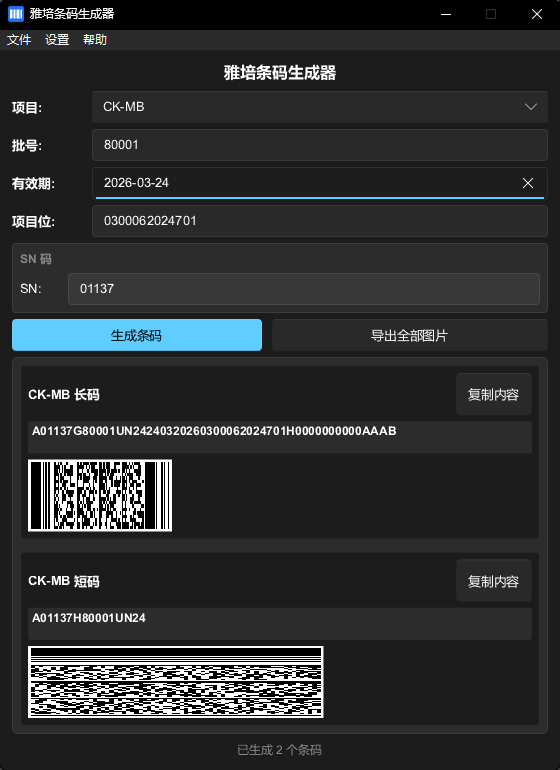

# 软件设计

目前有4组项目 CTNI、CK-MB、Myo、BNP。

CTNI 与 CK-MB 项目是两个试剂瓶，也就是两个条码一组。

一长一短，也就是红色与黄色。

`A` 固定，无需在意。`01137` 为 SN 码，G81307UD00 是 `Control No.` 批次号，其中 `G` 是因为红码。

而 `07042026` 代表 2026-04-07，它将日写在前面然后才是月和年。

`6201010300001H` 代表 CTNI 这个项目，是仪器识别项目的字段。

后续的 `0000162001AAAGOAABTZAAINQABPTEBCAUMDXUWW00000AAAAAAAAAAAAAAAAAAAAAAAAAAAAAA` 照抄即可，无需在意。

```txt
A01137G81307UD00070420266201010300001H0000162001AAAGOAABTZAAINQABPTEBCAUMDXUWW00000AAAAAAAAAAAAAAAAAAAAAAAAAAAAAA
```

黄码仅仅保有 `SN码` 与 `Control No.`。

`SN码` 无需与组合的红色长码一致，但是 `Control No.` 必须一致，这是一组项目的唯一标识。

黄色断码用 `H` 分隔，红色长码用 `G` 分隔。

```txt
A01137H81307UD00
```

另外 `81307UD00` 这种唯唯一标识，我们一般从 `80001UD00` 这样开始，除去第一位的后四位递增。

---

`CK-MB` 项目也同理，完整条码如下：

```txt
A03157G93880UN24300620264712010300001H0000000000AAAAAAAAAAAAAAAAAAAAAAAAAAAAAA00000AAAAAAAAAAAAAAAAAAAAAAAAAAAAAA

A06975H93880UN24
```

重要：短码必须为 `columns:2,eclevel:6`、`Compact PDF417`。高度 `1.8` cm 长度 `7.4` cm。
长码则使用标准 PDF417 生成即可，但是高度 `2.0` cm 长度 `4.0` cm。

---

Myo 项目与 BNP 项目是三个一组，其实没太多区别。分为红、黄、绿三种颜色，红色长码，黄色短码，绿色短码。

```txt
A03157G71084UN24310520264612010300002HJ000000000AAAAAAAAAAAAAAAAAAAAAAAAAAAAAA00000AAAAAAAAAAAAAAAAAAAAAAAAAAAAAA

A02972H71084UN24

A03824J71084UN24
```

规则是一致的，红色长码使用 `G` 分隔，黄色短码使用 `H` 分隔，绿色短码使用 `J` 分隔。

以及他们的`Control No.` 都必须一致。但是 SN 可以不一致。

现在我需要你帮我修改当前软件的设置，目前有问题。

用户需要能够看到根据输入框选项等，生成的多个条码内容，并且能够直接复制这些条码内容。

用户需要能够输入 项目	组别	SN码	Control No.	有效期	项目位

这些，然后再自动组合拼接。

---

Myo 与 BNP 项目存在 BUG，点击生成后生成了6张图片，并且有三个SN输入，却没应用。

CTNI 与 CK-MB 生成图片是两张没问题，但是 SN 码却无法独立设置。

默认 SN 码不应该全是 1137，应该按照上面给的四个项目来默认设置不同的默认 SN 码。

